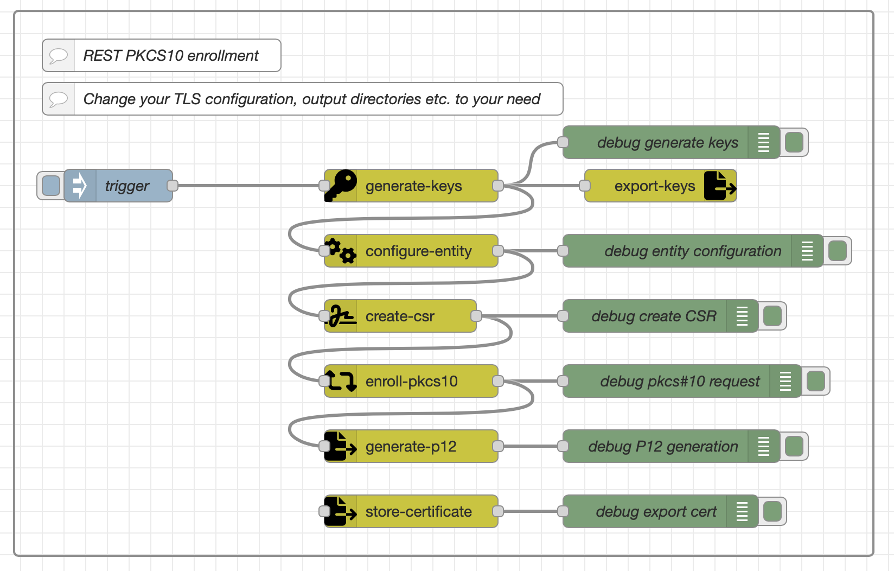
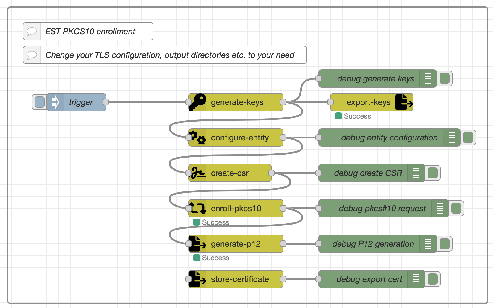
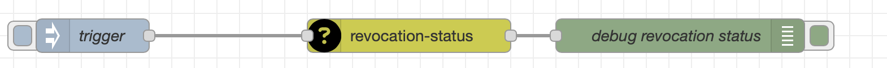
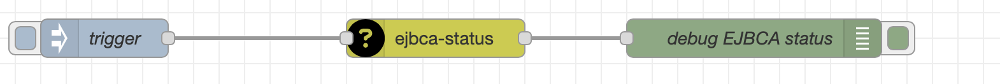

# node-red-contrib-ejbca Integration Package


This Node-RED package provides a set of nodes for integrating with the EJBCA (Enterprise JavaBeans Certificate
Authority) using the EJBCA REST (and EST for pkcs10 enrollment) interface. With these nodes, you can automate certificate management tasks and create
custom certificate workflows within Node-RED.

> To setup EJBCA follow the documentation on https://www.ejbca.org

> ⚠️ Warning: ⚠️ Use this node with care! Some nodes expose credentials and key material to the flow (and thus to the memory). Therefore you should only use it in a trusted environment.

## Table of Contents

- [Installation](#installation)
- [Configuration](#configuration)
- [Nodes](#nodes)
- [Usage Examples](#usage-examples)
- [Contributing](#contributing)
- [License](#license)

## Installation

To install this Node-RED package, follow these steps:

1. Open your Node-RED instance.

2. Go to the menu on the top-right corner and select "Manage palette."

3. In the "Install" tab, search for "node-red-contrib-ejbca" and click "Install" to add the package to your Node-RED
   instance.

4. After installation, restart Node-RED for the changes to take effect.

## Configuration

Before using the nodes, you must configure the EJBCA connection by creating an "EJBCA Configuration" node. The
configuration should have the following structure:

```json
{
    "subjects": [
        {
            "property": "CN",
            "prop_value": "",
            "prop_required": true,
            "prop_modifiable": true
        },
        {
            "property": "O",
            "prop_value": "Campus Schwarzwald",
            "prop_required": true,
            "prop_modifiable": false
        },
        {
            "property": "OU",
            "prop_value": "Showcase Robot",
            "prop_required": true,
            "prop_modifiable": false
        },
        {
            "property": "C",
            "prop_value": "DE",
            "prop_required": true,
            "prop_modifiable": false
        }
    ],
    "subject_alternative_names": [],
    "profile": {
        "hostname": "campuspki.germanywestcentral.cloudapp.azure.com",
        "certificate_profile_name": "KF-CS-ShowcaseRobot-MQTT-CertProfile",
        "end_entity_profile_name": "KF-CS-ShowcaseRobot-MQTT-Client-EndEntity",
        "certificate_authority_name": "KS-CS-ShowcaseRobot-MQTT-CA",
        "est_alias": "est_node_red_alias",
        "username": {
            "value": "",
            "auto_generated": false
        },
        "enrollment_code": {
            "required": true,
            "auto_generated": false,
            "minimum_bits": 0
        },
        "mail": {
            "use": true,
            "required": false,
            "modifiable": false
        }
    }
}
```

## Nodes

This package includes the following nodes:

* **configure-entity**: This node handles the configuration related to a PKCS10 signing request.
* **create-csr**: This node is used to create a PKCS10 Certificate Signing Request (CSR) which is a request for a
  digital certificate.
* **ejbca-config** (config-node): This is a configuration node that stores the connection settings and certificate
  related settings for the EJBCA instance.
* **ejbca-status**: This node is used to check the status or health of the EJBCA instance.
* **enroll-keystore**: This node enrolls a keystore, which is a container for keys and certificates.
* **enroll-pkcs10**: This node is used to enroll or request a certificate using a PKCS#10 Certificate Signing Request (
  CSR).
* **export-keys**: This node is used to export cryptographic keys.
* **generate-keys**: This node generates cryptographic keys.
* **generate-p12**: This node generates a PKCS#12 (P12) file, which typically includes a private key and its associated
  certificate.
* **revocation-status**: This node checks the revocation status of a certificate.
* **revoke**: This node is used to revoke a certificate.
* **search-certificates**: This node is used to search for certificates within the EJBCA instance.
* **store-certificate**: This node stores a DER string to a certificate on the local drive

## Usage Examples

To help you get started, here are some usage examples and workflows that demonstrate how to use the nodes in this
package:

### Example 1: Certificate Enrollment Workflow (REST)



<details>
  <summary>Click to expand/collapse</summary>

```json
[
    {
        "id": "4a8f91e0c158c01b",
        "type": "group",
        "z": "c24ed033437e3a9c",
        "name": "",
        "style": {
            "label": true
        },
        "nodes": [
            "cd77f7e51ee95a69",
            "51ed0a3da61da078",
            "dcc9fdfd9f9fe965",
            "ccc6d6bf75331f5d",
            "bab0272bb0b06c43",
            "5aa108b5dac99c07",
            "0f23e62bc183354d",
            "2894c040a64d63c7",
            "9f55b1cdc9c2bd71",
            "b579dd08a623fa1e",
            "f457e9b4239a4f4b",
            "9cad83db3f458788",
            "82c1edab45b9f80f",
            "d605822ff1bace88",
            "868049c2e421cc9a",
            "1365558a7084ce5d"
        ],
        "x": 74,
        "y": 879,
        "w": 792,
        "h": 502
    },
    {
        "id": "cd77f7e51ee95a69",
        "type": "generate-keys",
        "z": "c24ed033437e3a9c",
        "g": "4a8f91e0c158c01b",
        "name": "",
        "bitLength": "2048",
        "x": 440,
        "y": 1040,
        "wires": [
            [
                "bab0272bb0b06c43",
                "9cad83db3f458788",
                "51ed0a3da61da078"
            ]
        ]
    },
    {
        "id": "51ed0a3da61da078",
        "type": "configure-entity",
        "z": "c24ed033437e3a9c",
        "g": "4a8f91e0c158c01b",
        "name": "",
        "ejbcaConfig": "4eedf14773d23515",
        "CN": "test",
        "O": "Campus Schwarzwald",
        "OU": "Showcase Robot",
        "C": "DE",
        "L": "",
        "ST": "",
        "postalCode": "",
        "streetAdress": "",
        "serialNumber": "",
        "emailAdress": "",
        "givenName": "",
        "surName": "",
        "initials": "",
        "title": "",
        "description": "",
        "ipAddress1": "",
        "ipAddress2": "",
        "ipAddress3": "",
        "Uri1": "",
        "Uri2": "",
        "Uri3": "",
        "Dns1": "",
        "Dns2": "",
        "Dns3": "",
        "x": 440,
        "y": 1100,
        "wires": [
            [
                "5aa108b5dac99c07",
                "f457e9b4239a4f4b"
            ]
        ]
    },
    {
        "id": "dcc9fdfd9f9fe965",
        "type": "enroll-pkcs10",
        "z": "c24ed033437e3a9c",
        "g": "4a8f91e0c158c01b",
        "name": "",
        "tls": "7f5a2ba045b1a9b1",
        "ejbcaConfig": "4eedf14773d23515",
        "client_type": "REST",
        "username_fieldType": "str",
        "username": "node_red_test_user_fhk",
        "csrInfo_fieldType": "msg",
        "csrInfo": "ejbca.csr",
        "enrollment_code": "foo123",
        "x": 440,
        "y": 1220,
        "wires": [
            [
                "2894c040a64d63c7",
                "ccc6d6bf75331f5d"
            ]
        ]
    },
    {
        "id": "ccc6d6bf75331f5d",
        "type": "generate-p12",
        "z": "c24ed033437e3a9c",
        "g": "4a8f91e0c158c01b",
        "name": "",
        "outputDirectory_fieldType": "str",
        "outputDirectory": "/Users/florianhandke/Downloads",
        "fileName_fieldType": "str",
        "fileName": "x509_cert_1",
        "p12_password": "foo123",
        "x": 440,
        "y": 1280,
        "wires": [
            [
                "9f55b1cdc9c2bd71"
            ]
        ]
    },
    {
        "id": "bab0272bb0b06c43",
        "type": "debug",
        "z": "c24ed033437e3a9c",
        "g": "4a8f91e0c158c01b",
        "name": "debug generate keys",
        "active": true,
        "tosidebar": true,
        "console": false,
        "tostatus": false,
        "complete": "true",
        "targetType": "full",
        "statusVal": "",
        "statusType": "auto",
        "x": 680,
        "y": 1000,
        "wires": []
    },
    {
        "id": "5aa108b5dac99c07",
        "type": "debug",
        "z": "c24ed033437e3a9c",
        "g": "4a8f91e0c158c01b",
        "name": "debug entity configuration",
        "active": true,
        "tosidebar": true,
        "console": false,
        "tostatus": false,
        "complete": "true",
        "targetType": "full",
        "statusVal": "",
        "statusType": "auto",
        "x": 700,
        "y": 1100,
        "wires": []
    },
    {
        "id": "0f23e62bc183354d",
        "type": "debug",
        "z": "c24ed033437e3a9c",
        "g": "4a8f91e0c158c01b",
        "name": "debug create CSR",
        "active": true,
        "tosidebar": true,
        "console": false,
        "tostatus": false,
        "complete": "true",
        "targetType": "full",
        "statusVal": "",
        "statusType": "auto",
        "x": 670,
        "y": 1160,
        "wires": []
    },
    {
        "id": "2894c040a64d63c7",
        "type": "debug",
        "z": "c24ed033437e3a9c",
        "g": "4a8f91e0c158c01b",
        "name": "debug pkcs#10 request",
        "active": true,
        "tosidebar": true,
        "console": false,
        "tostatus": false,
        "complete": "true",
        "targetType": "full",
        "statusVal": "",
        "statusType": "auto",
        "x": 690,
        "y": 1220,
        "wires": []
    },
    {
        "id": "9f55b1cdc9c2bd71",
        "type": "debug",
        "z": "c24ed033437e3a9c",
        "g": "4a8f91e0c158c01b",
        "name": "debug P12 generation",
        "active": true,
        "tosidebar": true,
        "console": false,
        "tostatus": false,
        "complete": "true",
        "targetType": "full",
        "statusVal": "",
        "statusType": "auto",
        "x": 680,
        "y": 1280,
        "wires": []
    },
    {
        "id": "b579dd08a623fa1e",
        "type": "inject",
        "z": "c24ed033437e3a9c",
        "g": "4a8f91e0c158c01b",
        "name": "trigger",
        "props": [
            {
                "p": "payload"
            }
        ],
        "repeat": "",
        "crontab": "",
        "once": false,
        "onceDelay": 0.1,
        "topic": "",
        "payload": "",
        "payloadType": "date",
        "x": 170,
        "y": 1040,
        "wires": [
            [
                "cd77f7e51ee95a69"
            ]
        ]
    },
    {
        "id": "f457e9b4239a4f4b",
        "type": "create-csr",
        "z": "c24ed033437e3a9c",
        "g": "4a8f91e0c158c01b",
        "name": "",
        "subjectAltnames_fieldType": "msg",
        "subjectAltnames": "ejbca.subject_alternative_names",
        "subjects_fieldType": "msg",
        "subjects": "ejbca.subjects",
        "privateKey_fieldType": "msg",
        "privateKey": "ejbca.privateKey",
        "publicKey_fieldType": "msg",
        "publicKey": "ejbca.publicKey",
        "x": 430,
        "y": 1160,
        "wires": [
            [
                "dcc9fdfd9f9fe965",
                "0f23e62bc183354d"
            ]
        ]
    },
    {
        "id": "9cad83db3f458788",
        "type": "export-keys",
        "z": "c24ed033437e3a9c",
        "g": "4a8f91e0c158c01b",
        "name": "",
        "outputDirectory_fieldType": "str",
        "outputDirectory": "/Users/florianhandke/Downloads",
        "privatefileName_fieldType": "str",
        "privatefileName": "private_key",
        "publicfileName_fieldType": "str",
        "publicfileName": "public_key",
        "privateKey_fieldType": "msg",
        "privateKey": "ejbca.privateKey",
        "publicKey_fieldType": "msg",
        "publicKey": "ejbca.publicKey",
        "x": 670,
        "y": 1040,
        "wires": []
    },
    {
        "id": "82c1edab45b9f80f",
        "type": "store-certificate",
        "z": "c24ed033437e3a9c",
        "g": "4a8f91e0c158c01b",
        "name": "",
        "certificate_fieldType": "msg",
        "certificate": "ejbca.enroll_pkcs10.certificate",
        "outputDirectory_fieldType": "str",
        "outputDirectory": "/Users/florianhandke/Downloads",
        "fileName_fieldType": "str",
        "fileName": "testcert",
        "outputFormat": "DER",
        "fileExtension": "crt",
        "x": 440,
        "y": 1340,
        "wires": [
            [
                "d605822ff1bace88"
            ]
        ]
    },
    {
        "id": "d605822ff1bace88",
        "type": "debug",
        "z": "c24ed033437e3a9c",
        "g": "4a8f91e0c158c01b",
        "name": "debug export cert",
        "active": true,
        "tosidebar": true,
        "console": false,
        "tostatus": false,
        "complete": "true",
        "targetType": "full",
        "statusVal": "",
        "statusType": "auto",
        "x": 670,
        "y": 1340,
        "wires": []
    },
    {
        "id": "868049c2e421cc9a",
        "type": "comment",
        "z": "c24ed033437e3a9c",
        "g": "4a8f91e0c158c01b",
        "name": "REST PKCS10 enrollment",
        "info": "",
        "x": 210,
        "y": 920,
        "wires": []
    },
    {
        "id": "1365558a7084ce5d",
        "type": "comment",
        "z": "c24ed033437e3a9c",
        "g": "4a8f91e0c158c01b",
        "name": "Change your TLS configuration, output directories etc. to your need",
        "info": "",
        "x": 340,
        "y": 960,
        "wires": []
    },
    {
        "id": "4eedf14773d23515",
        "type": "ejbca-config-3",
        "name": "KF-CS-ShowcaseRobot-MQTT-Client-EndEntity",
        "ejbcaConf": "{\n    \"subjects\": [\n        {\n            \"property\": \"CN\",\n            \"prop_value\": \"\",\n            \"prop_required\": true,\n            \"prop_modifiable\": true\n        },\n        {\n            \"property\": \"O\",\n            \"prop_value\": \"Campus Schwarzwald\",\n            \"prop_required\": true,\n            \"prop_modifiable\": false\n        },\n        {\n            \"property\": \"OU\",\n            \"prop_value\": \"Showcase Robot\",\n            \"prop_required\": true,\n            \"prop_modifiable\": false\n        },\n        {\n            \"property\": \"C\",\n            \"prop_value\": \"DE\",\n            \"prop_required\": true,\n            \"prop_modifiable\": false\n        }\n    ],\n    \"subject_alternative_names\": [],\n    \"profile\": {\n        \"hostname\": \"campuspki.germanywestcentral.cloudapp.azure.com\",\n        \"certificate_profile_name\": \"KF-CS-ShowcaseRobot-MQTT-CertProfile\",\n        \"end_entity_profile_name\": \"KF-CS-ShowcaseRobot-MQTT-Client-EndEntity\",\n        \"certificate_authority_name\": \"KS-CS-ShowcaseRobot-MQTT-CA\",\n        \"est_alias\": \"est_node_red_alias\",\n        \"username\": {\n            \"value\": \"\",\n            \"auto_generated\": false\n        },\n        \"enrollment_code\": {\n            \"required\": true,\n            \"auto_generated\": false,\n            \"minimum_bits\": 0\n        },\n        \"mail\": {\n            \"use\": true,\n            \"required\": false,\n            \"modifiable\": false\n        }\n    }\n}"
    },
    {
        "id": "7f5a2ba045b1a9b1",
        "type": "tls-config",
        "name": "",
        "cert": "",
        "key": "",
        "ca": "",
        "certname": "NodeRedRestAdmin001.cert.pem",
        "keyname": "NodeRedRestAdmin001.key.pem",
        "caname": "ca-chain.cert.pem",
        "servername": "",
        "verifyservercert": true,
        "alpnprotocol": ""
    }
]
```

</details>

### Example 2: Certificate Enrollment Workflow (EST)



> For EST enrollment you need to an EST alias to your EJBCA-Config in `profile.est_alias`

<details>
  <summary>Click to expand/collapse</summary>

```json
[
    {
        "id": "5be4c59e7ae77b49",
        "type": "group",
        "z": "c24ed033437e3a9c",
        "style": {
            "stroke": "#999999",
            "stroke-opacity": "1",
            "fill": "none",
            "fill-opacity": "1",
            "label": true,
            "label-position": "nw",
            "color": "#a4a4a4"
        },
        "nodes": [
            "1e1d90a44661c2dc",
            "857b75b2703a5547",
            "10ed98f8720adaca",
            "9a8b01ac9b9d5bc8",
            "861d4a82fc7471d2",
            "47b6ba00be43e308",
            "bd7aaa5dbe362511",
            "55ebd375010e5ca5",
            "4f57f015d2716d39",
            "9a35189ec430d633",
            "22747245529fa398",
            "72e52041865e0fec",
            "cd4c0b0979d81a43",
            "b98476be7ea0f58e",
            "68032d67d0654b4f",
            "c25362bbc892d289"
        ],
        "x": 74,
        "y": 359,
        "w": 812,
        "h": 502
    },
    {
        "id": "1e1d90a44661c2dc",
        "type": "generate-keys",
        "z": "c24ed033437e3a9c",
        "g": "5be4c59e7ae77b49",
        "name": "",
        "bitLength": "2048",
        "x": 460,
        "y": 520,
        "wires": [
            [
                "861d4a82fc7471d2",
                "72e52041865e0fec",
                "857b75b2703a5547"
            ]
        ]
    },
    {
        "id": "857b75b2703a5547",
        "type": "configure-entity",
        "z": "c24ed033437e3a9c",
        "g": "5be4c59e7ae77b49",
        "name": "",
        "ejbcaConfig": "4eedf14773d23515",
        "CN": "test_est_002",
        "O": "Campus Schwarzwald",
        "OU": "Showcase Robot",
        "C": "DE",
        "L": "",
        "ST": "",
        "postalCode": "",
        "streetAdress": "",
        "serialNumber": "",
        "emailAdress": "",
        "givenName": "",
        "surName": "",
        "initials": "",
        "title": "",
        "description": "",
        "ipAddress1": "",
        "ipAddress2": "",
        "ipAddress3": "",
        "Uri1": "",
        "Uri2": "",
        "Uri3": "",
        "Dns1": "",
        "Dns2": "",
        "Dns3": "",
        "x": 460,
        "y": 580,
        "wires": [
            [
                "47b6ba00be43e308",
                "22747245529fa398"
            ]
        ]
    },
    {
        "id": "10ed98f8720adaca",
        "type": "enroll-pkcs10",
        "z": "c24ed033437e3a9c",
        "g": "5be4c59e7ae77b49",
        "name": "",
        "tls": "7f5a2ba045b1a9b1",
        "ejbcaConfig": "4eedf14773d23515",
        "client_type": "EST",
        "username_fieldType": "str",
        "username": "node_red_test_user_fhk",
        "csrInfo_fieldType": "msg",
        "csrInfo": "ejbca.csr",
        "enrollment_code": "foo123",
        "x": 460,
        "y": 700,
        "wires": [
            [
                "55ebd375010e5ca5",
                "9a8b01ac9b9d5bc8"
            ]
        ]
    },
    {
        "id": "9a8b01ac9b9d5bc8",
        "type": "generate-p12",
        "z": "c24ed033437e3a9c",
        "g": "5be4c59e7ae77b49",
        "name": "",
        "outputDirectory_fieldType": "str",
        "outputDirectory": "/Users/florianhandke/Downloads",
        "fileName_fieldType": "str",
        "fileName": "x509_cert_est_1",
        "p12_password": "foo123",
        "x": 460,
        "y": 760,
        "wires": [
            [
                "4f57f015d2716d39"
            ]
        ]
    },
    {
        "id": "861d4a82fc7471d2",
        "type": "debug",
        "z": "c24ed033437e3a9c",
        "g": "5be4c59e7ae77b49",
        "name": "debug generate keys",
        "active": true,
        "tosidebar": true,
        "console": false,
        "tostatus": false,
        "complete": "true",
        "targetType": "full",
        "statusVal": "",
        "statusType": "auto",
        "x": 700,
        "y": 480,
        "wires": []
    },
    {
        "id": "47b6ba00be43e308",
        "type": "debug",
        "z": "c24ed033437e3a9c",
        "g": "5be4c59e7ae77b49",
        "name": "debug entity configuration",
        "active": true,
        "tosidebar": true,
        "console": false,
        "tostatus": false,
        "complete": "true",
        "targetType": "full",
        "statusVal": "",
        "statusType": "auto",
        "x": 720,
        "y": 580,
        "wires": []
    },
    {
        "id": "bd7aaa5dbe362511",
        "type": "debug",
        "z": "c24ed033437e3a9c",
        "g": "5be4c59e7ae77b49",
        "name": "debug create CSR",
        "active": true,
        "tosidebar": true,
        "console": false,
        "tostatus": false,
        "complete": "true",
        "targetType": "full",
        "statusVal": "",
        "statusType": "auto",
        "x": 690,
        "y": 640,
        "wires": []
    },
    {
        "id": "55ebd375010e5ca5",
        "type": "debug",
        "z": "c24ed033437e3a9c",
        "g": "5be4c59e7ae77b49",
        "name": "debug pkcs#10 request",
        "active": true,
        "tosidebar": true,
        "console": false,
        "tostatus": false,
        "complete": "true",
        "targetType": "full",
        "statusVal": "",
        "statusType": "auto",
        "x": 710,
        "y": 700,
        "wires": []
    },
    {
        "id": "4f57f015d2716d39",
        "type": "debug",
        "z": "c24ed033437e3a9c",
        "g": "5be4c59e7ae77b49",
        "name": "debug P12 generation",
        "active": true,
        "tosidebar": true,
        "console": false,
        "tostatus": false,
        "complete": "true",
        "targetType": "full",
        "statusVal": "",
        "statusType": "auto",
        "x": 700,
        "y": 760,
        "wires": []
    },
    {
        "id": "9a35189ec430d633",
        "type": "inject",
        "z": "c24ed033437e3a9c",
        "g": "5be4c59e7ae77b49",
        "name": "trigger",
        "props": [
            {
                "p": "payload"
            }
        ],
        "repeat": "",
        "crontab": "",
        "once": false,
        "onceDelay": 0.1,
        "topic": "",
        "payload": "",
        "payloadType": "date",
        "x": 190,
        "y": 520,
        "wires": [
            [
                "1e1d90a44661c2dc"
            ]
        ]
    },
    {
        "id": "22747245529fa398",
        "type": "create-csr",
        "z": "c24ed033437e3a9c",
        "g": "5be4c59e7ae77b49",
        "name": "",
        "subjectAltnames_fieldType": "msg",
        "subjectAltnames": "ejbca.subject_alternative_names",
        "subjects_fieldType": "msg",
        "subjects": "ejbca.subjects",
        "privateKey_fieldType": "msg",
        "privateKey": "ejbca.privateKey",
        "publicKey_fieldType": "msg",
        "publicKey": "ejbca.publicKey",
        "x": 450,
        "y": 640,
        "wires": [
            [
                "10ed98f8720adaca",
                "bd7aaa5dbe362511"
            ]
        ]
    },
    {
        "id": "72e52041865e0fec",
        "type": "export-keys",
        "z": "c24ed033437e3a9c",
        "g": "5be4c59e7ae77b49",
        "name": "",
        "outputDirectory_fieldType": "str",
        "outputDirectory": "/Users/florianhandke/Downloads",
        "privatefileName_fieldType": "str",
        "privatefileName": "private_key",
        "publicfileName_fieldType": "str",
        "publicfileName": "public_key",
        "privateKey_fieldType": "msg",
        "privateKey": "ejbca.privateKey",
        "publicKey_fieldType": "msg",
        "publicKey": "ejbca.publicKey",
        "x": 690,
        "y": 520,
        "wires": []
    },
    {
        "id": "cd4c0b0979d81a43",
        "type": "store-certificate",
        "z": "c24ed033437e3a9c",
        "g": "5be4c59e7ae77b49",
        "name": "",
        "certificate_fieldType": "msg",
        "certificate": "ejbca.enroll_pkcs10.certificate",
        "outputDirectory_fieldType": "str",
        "outputDirectory": "/Users/florianhandke/Downloads",
        "fileName_fieldType": "str",
        "fileName": "testcert_est_01",
        "outputFormat": "DER",
        "fileExtension": "cer",
        "x": 460,
        "y": 820,
        "wires": [
            [
                "b98476be7ea0f58e"
            ]
        ]
    },
    {
        "id": "b98476be7ea0f58e",
        "type": "debug",
        "z": "c24ed033437e3a9c",
        "g": "5be4c59e7ae77b49",
        "name": "debug export cert",
        "active": true,
        "tosidebar": true,
        "console": false,
        "tostatus": false,
        "complete": "true",
        "targetType": "full",
        "statusVal": "",
        "statusType": "auto",
        "x": 690,
        "y": 820,
        "wires": []
    },
    {
        "id": "68032d67d0654b4f",
        "type": "comment",
        "z": "c24ed033437e3a9c",
        "g": "5be4c59e7ae77b49",
        "name": "EST PKCS10 enrollment",
        "info": "",
        "x": 210,
        "y": 400,
        "wires": []
    },
    {
        "id": "c25362bbc892d289",
        "type": "comment",
        "z": "c24ed033437e3a9c",
        "g": "5be4c59e7ae77b49",
        "name": "Change your TLS configuration, output directories etc. to your need",
        "info": "",
        "x": 340,
        "y": 440,
        "wires": []
    },
    {
        "id": "4eedf14773d23515",
        "type": "ejbca-config-3",
        "name": "KF-CS-ShowcaseRobot-MQTT-Client-EndEntity",
        "ejbcaConf": "{\n    \"subjects\": [\n        {\n            \"property\": \"CN\",\n            \"prop_value\": \"\",\n            \"prop_required\": true,\n            \"prop_modifiable\": true\n        },\n        {\n            \"property\": \"O\",\n            \"prop_value\": \"Campus Schwarzwald\",\n            \"prop_required\": true,\n            \"prop_modifiable\": false\n        },\n        {\n            \"property\": \"OU\",\n            \"prop_value\": \"Showcase Robot\",\n            \"prop_required\": true,\n            \"prop_modifiable\": false\n        },\n        {\n            \"property\": \"C\",\n            \"prop_value\": \"DE\",\n            \"prop_required\": true,\n            \"prop_modifiable\": false\n        }\n    ],\n    \"subject_alternative_names\": [],\n    \"profile\": {\n        \"hostname\": \"campuspki.germanywestcentral.cloudapp.azure.com\",\n        \"certificate_profile_name\": \"KF-CS-ShowcaseRobot-MQTT-CertProfile\",\n        \"end_entity_profile_name\": \"KF-CS-ShowcaseRobot-MQTT-Client-EndEntity\",\n        \"certificate_authority_name\": \"KS-CS-ShowcaseRobot-MQTT-CA\",\n        \"est_alias\": \"est_node_red_alias\",\n        \"username\": {\n            \"value\": \"\",\n            \"auto_generated\": false\n        },\n        \"enrollment_code\": {\n            \"required\": true,\n            \"auto_generated\": false,\n            \"minimum_bits\": 0\n        },\n        \"mail\": {\n            \"use\": true,\n            \"required\": false,\n            \"modifiable\": false\n        }\n    }\n}"
    },
    {
        "id": "7f5a2ba045b1a9b1",
        "type": "tls-config",
        "name": "",
        "cert": "",
        "key": "",
        "ca": "",
        "certname": "NodeRedRestAdmin001.cert.pem",
        "keyname": "NodeRedRestAdmin001.key.pem",
        "caname": "ca-chain.cert.pem",
        "servername": "",
        "verifyservercert": true,
        "alpnprotocol": ""
    }
]
```

</details>

### Example 3: Certificate Revocation Status



<details>
  <summary>Click to expand/collapse</summary>

```json
[
    {
        "id": "4c882a8e897f4a62",
        "type": "revocation-status",
        "z": "c24ed033437e3a9c",
        "name": "",
        "tls": "7f5a2ba045b1a9b1",
        "ejbcaConfig": "4eedf14773d23515",
        "serialNumber_fieldType": "str",
        "serialNumber": "6BC04C40DD3E4B7F90340CC8B6F4660FCE931939",
        "x": 470,
        "y": 160,
        "wires": [
            [
                "160147056b61e853"
            ]
        ]
    },
    {
        "id": "5e198606b2b6739d",
        "type": "inject",
        "z": "c24ed033437e3a9c",
        "name": "trigger",
        "props": [
            {
                "p": "payload"
            }
        ],
        "repeat": "",
        "crontab": "",
        "once": false,
        "onceDelay": 0.1,
        "topic": "",
        "payload": "",
        "payloadType": "date",
        "x": 190,
        "y": 160,
        "wires": [
            [
                "4c882a8e897f4a62"
            ]
        ]
    },
    {
        "id": "160147056b61e853",
        "type": "debug",
        "z": "c24ed033437e3a9c",
        "name": "debug revocation status",
        "active": true,
        "tosidebar": true,
        "console": false,
        "tostatus": false,
        "complete": "true",
        "targetType": "full",
        "statusVal": "",
        "statusType": "auto",
        "x": 710,
        "y": 160,
        "wires": []
    },
    {
        "id": "7f5a2ba045b1a9b1",
        "type": "tls-config",
        "name": "",
        "cert": "",
        "key": "",
        "ca": "",
        "certname": "NodeRedRestAdmin001.cert.pem",
        "keyname": "NodeRedRestAdmin001.key.pem",
        "caname": "ca-chain.cert.pem",
        "servername": "",
        "verifyservercert": true,
        "alpnprotocol": ""
    },
    {
        "id": "4eedf14773d23515",
        "type": "ejbca-config-3",
        "name": "KF-CS-ShowcaseRobot-MQTT-Client-EndEntity",
        "ejbcaConf": "{\n    \"subjects\": [\n        {\n            \"property\": \"CN\",\n            \"prop_value\": \"\",\n            \"prop_required\": true,\n            \"prop_modifiable\": true\n        },\n        {\n            \"property\": \"O\",\n            \"prop_value\": \"Campus Schwarzwald\",\n            \"prop_required\": true,\n            \"prop_modifiable\": false\n        },\n        {\n            \"property\": \"OU\",\n            \"prop_value\": \"Showcase Robot\",\n            \"prop_required\": true,\n            \"prop_modifiable\": false\n        },\n        {\n            \"property\": \"C\",\n            \"prop_value\": \"DE\",\n            \"prop_required\": true,\n            \"prop_modifiable\": false\n        }\n    ],\n    \"subject_alternative_names\": [],\n    \"profile\": {\n        \"hostname\": \"campuspki.germanywestcentral.cloudapp.azure.com\",\n        \"certificate_profile_name\": \"KF-CS-ShowcaseRobot-MQTT-CertProfile\",\n        \"end_entity_profile_name\": \"KF-CS-ShowcaseRobot-MQTT-Client-EndEntity\",\n        \"certificate_authority_name\": \"KS-CS-ShowcaseRobot-MQTT-CA\",\n        \"username\": {\n            \"value\": \"\",\n            \"auto_generated\": false\n        },\n        \"enrollment_code\": {\n            \"required\": true,\n            \"auto_generated\": false,\n            \"minimum_bits\": 0\n        },\n        \"mail\": {\n            \"use\": true,\n            \"required\": false,\n            \"modifiable\": false\n        }\n    }\n}"
    }
]
```

</details>

### Example 4: EJBCA Status Check



<details>
  <summary>Click to expand/collapse</summary>

```json
[
    {
        "id": "aa2a9a549ee0b813",
        "type": "ejbca-status",
        "z": "c24ed033437e3a9c",
        "name": "",
        "tls": "7f5a2ba045b1a9b1",
        "ejbcaConfig": "4eedf14773d23515",
        "x": 450,
        "y": 80,
        "wires": [
            [
                "aff9a51a7c018eef"
            ]
        ]
    },
    {
        "id": "aff9a51a7c018eef",
        "type": "debug",
        "z": "c24ed033437e3a9c",
        "name": "debug EJBCA status",
        "active": true,
        "tosidebar": true,
        "console": false,
        "tostatus": false,
        "complete": "true",
        "targetType": "full",
        "statusVal": "",
        "statusType": "auto",
        "x": 700,
        "y": 80,
        "wires": []
    },
    {
        "id": "a65c6140332d3fa3",
        "type": "inject",
        "z": "c24ed033437e3a9c",
        "name": "trigger",
        "props": [
            {
                "p": "payload"
            }
        ],
        "repeat": "",
        "crontab": "",
        "once": false,
        "onceDelay": 0.1,
        "topic": "",
        "payload": "",
        "payloadType": "date",
        "x": 190,
        "y": 80,
        "wires": [
            [
                "aa2a9a549ee0b813"
            ]
        ]
    },
    {
        "id": "7f5a2ba045b1a9b1",
        "type": "tls-config",
        "name": "",
        "cert": "",
        "key": "",
        "ca": "",
        "certname": "NodeRedRestAdmin001.cert.pem",
        "keyname": "NodeRedRestAdmin001.key.pem",
        "caname": "ca-chain.cert.pem",
        "servername": "",
        "verifyservercert": true,
        "alpnprotocol": ""
    },
    {
        "id": "4eedf14773d23515",
        "type": "ejbca-config-3",
        "name": "KF-CS-ShowcaseRobot-MQTT-Client-EndEntity",
        "ejbcaConf": "{\n    \"subjects\": [\n        {\n            \"property\": \"CN\",\n            \"prop_value\": \"\",\n            \"prop_required\": true,\n            \"prop_modifiable\": true\n        },\n        {\n            \"property\": \"O\",\n            \"prop_value\": \"Campus Schwarzwald\",\n            \"prop_required\": true,\n            \"prop_modifiable\": false\n        },\n        {\n            \"property\": \"OU\",\n            \"prop_value\": \"Showcase Robot\",\n            \"prop_required\": true,\n            \"prop_modifiable\": false\n        },\n        {\n            \"property\": \"C\",\n            \"prop_value\": \"DE\",\n            \"prop_required\": true,\n            \"prop_modifiable\": false\n        }\n    ],\n    \"subject_alternative_names\": [],\n    \"profile\": {\n        \"hostname\": \"campuspki.germanywestcentral.cloudapp.azure.com\",\n        \"certificate_profile_name\": \"KF-CS-ShowcaseRobot-MQTT-CertProfile\",\n        \"end_entity_profile_name\": \"KF-CS-ShowcaseRobot-MQTT-Client-EndEntity\",\n        \"certificate_authority_name\": \"KS-CS-ShowcaseRobot-MQTT-CA\",\n        \"username\": {\n            \"value\": \"\",\n            \"auto_generated\": false\n        },\n        \"enrollment_code\": {\n            \"required\": true,\n            \"auto_generated\": false,\n            \"minimum_bits\": 0\n        },\n        \"mail\": {\n            \"use\": true,\n            \"required\": false,\n            \"modifiable\": false\n        }\n    }\n}"
    }
]
```

</details>

## Contributing

Contributions are welcome! If you would like to contribute to this project or report issues, please follow
our [Contributing Guidelines](/CONTRIBUTING.md).

## License

This Node-RED EJBCA Integration Package is licensed under the [MIT License](/LICENSE).

## Authors

**FHatCSW** - [GitHub Profile](https://github.com/FHatCSW)